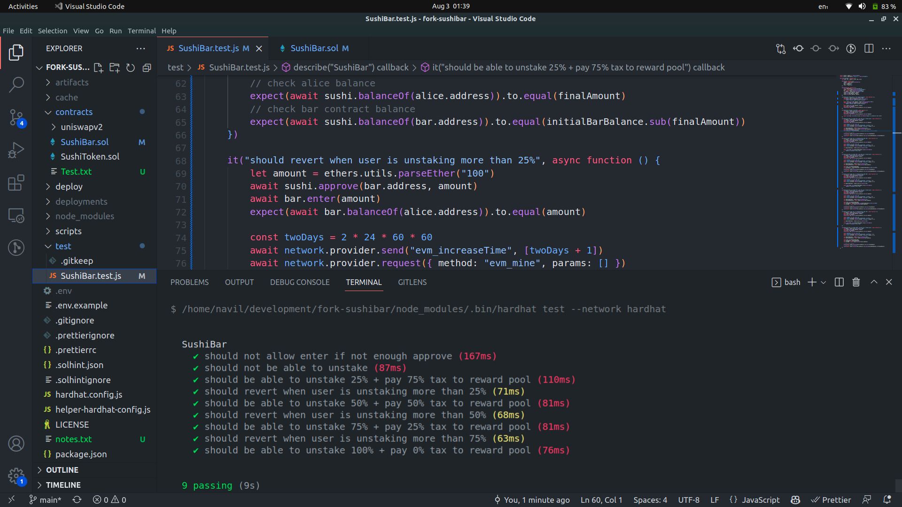

# SushiSwap Sushibar fork
## Requirements

- [git](https://git-scm.com/book/en/v2/Getting-Started-Installing-Git)
  - You'll know you did it right if you can run `git --version` and you see a response like `git version x.x.x`
- [Nodejs](https://nodejs.org/en/)
  - You'll know you've installed nodejs right if you can run:
    - `node --version` and get an output like: `vx.x.x`
- [Yarn](https://yarnpkg.com/getting-started/install) instead of `npm`
  - You'll know you've installed yarn right if you can run:
    - `yarn --version` and get an output like: `x.x.x`
    - You might need to [install it with `npm`](https://classic.yarnpkg.com/lang/en/docs/install/) or `corepack`

## Quickstart

```
git clone https://github.com/rodriguesnavil/fork-sushibar
cd fork-sushibar
yarn
yarn hardhat
```
## Setup environment variables
Kindly refer ```.env.example``` file to create your own ```.env``` file.

## Testing

```
yarn hardhat test
```

## Problem statement
```
Fork SushiSwap’s SushiBar contract and implement following features Staking:
Time lock after staking:
- 2 days - 0% can be unstaked
- 2-4 days - 25% can be unstaked
- 4-6 days - 50% can be unstaked
- 6-8 days - 75% can be unstaked
After 8 days - 100% can be unstaked.

This will work like a high tax though.
- 0-2 days - locked
- 2-4 days - 75% tax
- 4-6 days - 50% tax
- 6-8 days - 25% tax
- After 8 days, 0% tax.

The tokens received on tax will go back into rewards pool.
The tax will be applied on Sushi tokens
```

## Solution
I have written two separate internal functions
- ```_unlock(uint256)```: It will take user staked amount as input and based on the calculation it will give the amount of sushi tokens that can be unstaked from the day they were staked

- ```_tax(uint256)```: it will take calculated unlocked amount from the previous function and will calculate the total tax that will be applicable

After the calculations, the amount(post tax) will be sent to the recipient

## Test case output screen


## Final conclusion
1. The solution is not capable of handling the scenario when the same user restakes token after certain interval of time. 
2. All though I have written test cases, I am not sure that the contract is robust and error free. Given enough time I may write a well-tested code.

